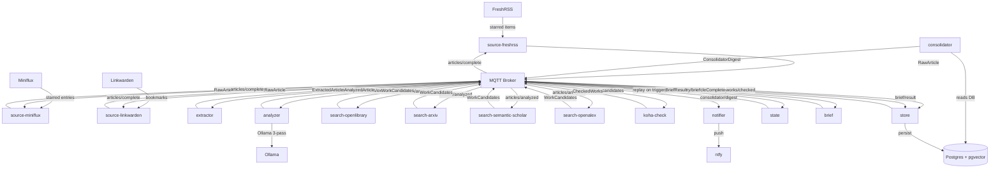
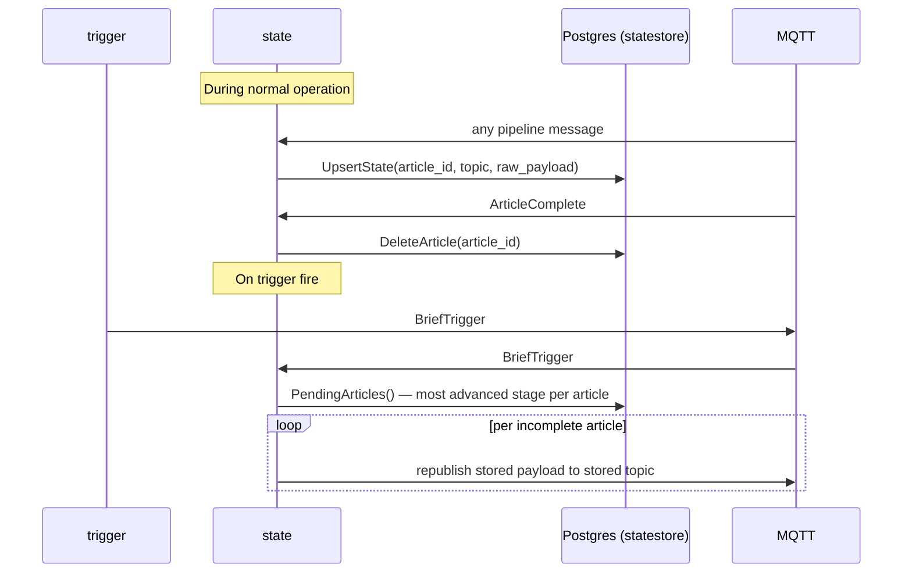
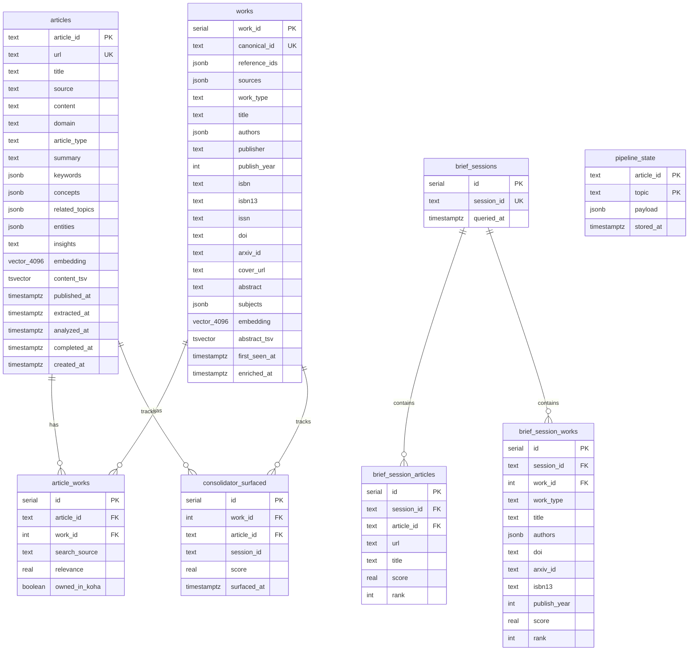

# Minerva — Architecture

> _MQTT-native, Postgres-backed with pgvector, built in Go._

**As of**: April 2026

---

## Table of Contents

1. [System Overview](#1-system-overview)
2. [Component Inventory](#2-component-inventory)
3. [Data Flow](#3-data-flow)
4. [MQTT Topic Map](#4-mqtt-topic-map)
5. [Data Model](#5-data-model)
6. [Key Data Structures](#6-key-data-structures)
7. [Analyzer Pipeline](#7-analyzer-pipeline)
8. [Brief Retrieval Pipeline](#8-brief-retrieval-pipeline)
9. [Consolidation and Notification Pipeline](#9-consolidation-and-notification-pipeline)
10. [Journal Integration Protocol](#10-journal-integration-protocol)
11. [Infrastructure and Deployment](#11-infrastructure-and-deployment)
12. [Invariants](#12-invariants)
13. [Known Constraints and Tradeoffs](#13-known-constraints-and-tradeoffs)

---

## 1. System Overview

Minerva is a pipeline system that transforms RSS starred articles and bookmarks into book and paper recommendations. It is built around three architectural principles:

1. **MQTT-native**: all inter-primitive communication via message broker. No direct function calls, no shared state between primitives.
2. **Postgres with pgvector**: all persistent state, including 4096-dimensional embedding vectors, lives in a single PostgreSQL database.
3. **Ollama on host**: all LLM inference and embedding runs locally via Ollama, with no external API dependencies beyond search sources.



---

## 2. Component Inventory

### Long-Running Services

| Binary | Role | Trigger |
|--------|------|---------|
| `entry-ingest` (source-freshrss) | Fetches starred items from FreshRSS; dedup via `store.IsComplete`; publishes `RawArticle` | MQTT: `minerva/pipeline/trigger`, `minerva/articles/complete` |
| `source-miniflux` | Fetches starred entries from Miniflux; same dedup pattern | MQTT: `minerva/pipeline/trigger`, `minerva/articles/complete` |
| `source-linkwarden` | Fetches bookmarks from Linkwarden; pagination cursor-based | MQTT: `minerva/pipeline/trigger`, `minerva/articles/complete` |
| `extractor` | Fetches and cleans article text; skips fetch if content pre-supplied | MQTT: `minerva/articles/raw` |
| `analyzer` | Three-pass Ollama LLM analysis; serialized via mutex | MQTT: `minerva/articles/extracted` |
| `search-openlibrary` | Book search via OpenLibrary API | MQTT: `minerva/articles/analyzed` |
| `search-arxiv` | Preprint search via arXiv API; rate-limited queue (6s gap) | MQTT: `minerva/articles/analyzed` |
| `search-semantic-scholar` | Academic paper search; rate-limited queue (~1 req/s) | MQTT: `minerva/articles/analyzed` |
| `search-openalex` | Scholarly works search; polite sequential access (2s delay) | MQTT: `minerva/articles/analyzed` |
| `koha-check` | Filters books against Koha library catalog by ISBN | MQTT: `minerva/works/candidates` |
| `store` | Pure observer; persists full knowledge base; publishes `ArticleComplete` | MQTT: `minerva/articles/extracted`, `analyzed`, `works/candidates`, `works/checked`, `brief/result` |
| `state` | Pure observer during normal operation; records raw payloads; replays on trigger | MQTT: all pipeline topics + `pipeline/trigger`, `articles/complete` |
| `brief` | Answers queries with ANN vector or keyword search against corpus | MQTT: `minerva/query/brief` |
| `brief-assemble` | (alias for brief) | — |
| `consolidator` | Aggregates brief session scores; deduplicates; publishes digest | Scheduled / manual trigger |
| `notifier` | Formats and sends ntfy push notifications | MQTT: `minerva/consolidator/digest` |

### CLI Tools

| Binary | Role | When Run |
|--------|------|----------|
| `trigger` | Publishes `BriefTrigger` to start a pipeline run | Cron or manual |

---

## 3. Data Flow

### Article Lifecycle

```mermaid
sequenceDiagram
    participant SRC as source-*
    participant MQTT
    participant EX as extractor
    participant AN as analyzer
    participant Ollama
    participant SEARCH as search-* (parallel)
    participant KC as koha-check
    participant ST as store
    participant DB as Postgres

    SRC->>DB: IsComplete(url)?
    DB-->>SRC: false
    SRC->>MQTT: RawArticle (articles/raw)

    MQTT->>EX: RawArticle
    EX->>EX: fetch + clean text (skip if content present)
    EX->>MQTT: ExtractedArticle (articles/extracted)

    MQTT->>AN: ExtractedArticle
    AN->>Ollama: Pass 1: classify
    Ollama-->>AN: domain, type, topic
    AN->>Ollama: Pass 2: entities (scoped by domain)
    Ollama-->>AN: facilities, people, locations, phenomena
    AN->>Ollama: Pass 3: concepts + related_topics
    Ollama-->>AN: concepts[], related_topics[]
    AN->>Ollama: Embed(topic + keywords + concepts)
    Ollama-->>AN: []float32 (4096-dim)
    AN->>MQTT: AnalyzedArticle (articles/analyzed)

    MQTT->>SEARCH: AnalyzedArticle (all 4 search primitives receive)
    SEARCH->>SEARCH: search by keywords + insights (rate-limited)
    SEARCH->>Ollama: Embed(title + abstract) per candidate
    SEARCH->>MQTT: WorkCandidates (works/candidates)

    MQTT->>KC: WorkCandidates
    KC->>KC: skip non-books; Koha ISBN lookup for books
    KC->>MQTT: CheckedWorks (works/checked)

    MQTT->>ST: CheckedWorks (and earlier stages)
    ST->>DB: UpsertWork (canonical_id dedup)
    ST->>DB: LinkArticleWork
    ST->>DB: MarkCompleteByArticleID
    ST->>MQTT: ArticleComplete (articles/complete)

    MQTT->>SRC: ArticleComplete → mark URL done
```

### Crash Recovery (State Primitive)



---

## 4. MQTT Topic Map

| Topic | Direction | Producer | Consumer | Message Type |
|-------|-----------|----------|----------|--------------|
| `minerva/pipeline/trigger` | inward | `trigger` CLI | source-*, `state` | `BriefTrigger` |
| `minerva/articles/raw` | pipeline | source-* | `extractor`, `state` | `RawArticle` |
| `minerva/articles/extracted` | pipeline | `extractor` | `analyzer`, `store`, `state` | `ExtractedArticle` |
| `minerva/articles/analyzed` | pipeline | `analyzer` | search-*, `store`, `state` | `AnalyzedArticle` |
| `minerva/articles/complete` | pipeline | `store` | source-*, `state` | `ArticleComplete` |
| `minerva/works/candidates` | pipeline | search-* | `koha-check`, `store`, `state` | `WorkCandidates` |
| `minerva/works/checked` | pipeline | `koha-check` | `store`, `state` | `CheckedWorks` |
| `minerva/query/brief` | inward | Journal / external | `brief` | `BriefQuery` |
| `minerva/brief/result` | outward | `brief` | `store` | `BriefResult` |
| `minerva/consolidator/digest` | outward | `consolidator` | `notifier` | `ConsolidatorDigest` |

All messages are JSON-encoded. All carry an `Envelope` header with `message_id`, `article_id`, `source`, `source_id`, and `timestamp`.

---

## 5. Data Model

### Schema Overview



### Key Constraints

- `articles`: unique on `url`. `article_id` is computed (`SHA256(url)[:16]`), not a sequence.
- `works`: unique on `canonical_id`. `reference_ids` and `sources` are JSONB arrays merged on upsert.
- `article_works`: unique on `(article_id, work_id)`.
- `pipeline_state`: primary key on `(article_id, topic)` — one row per article per stage.
- `articles.content_tsv` and `works.abstract_tsv` are `GENERATED ALWAYS AS ... STORED` tsvector columns for full-text search.

### Indexes

- `articles`: GIN on `content_tsv`, `keywords`, `concepts`; btree on `domain`, `created_at`; partial btree on `(published_at, source) WHERE completed_at IS NULL`.
- `works`: GIN on `abstract_tsv`, `subjects`; btree on `isbn13`, `doi`, `arxiv_id`, `work_type`.
- Vector indexes (HNSW): not created by default. Add manually once corpus size warrants it.

### Migrations

Auto-run on service startup from `internal/store/migrations/`. Files are numbered sequentially. Do not rename or reorder.

---

## 6. Key Data Structures

### Envelope (all messages)

```go
type Envelope struct {
    MessageID string    `json:"message_id"`
    ArticleID string    `json:"article_id"`
    Source    string    `json:"source"`    // "freshrss", "miniflux", "linkwarden"
    SourceID  string    `json:"source_id"` // source-native ID, optional
    Timestamp time.Time `json:"timestamp"`
}
```

### RawArticle (source-* → extractor)

```go
type RawArticle struct {
    Envelope
    URL     string `json:"url"`
    Title   string `json:"title"`
    Content string `json:"content"` // optional; if set, extractor skips HTTP fetch
}
```

### ExtractedArticle (extractor → analyzer)

```go
type ExtractedArticle struct {
    Envelope
    URL     string `json:"url"`
    Title   string `json:"title"`
    Content string `json:"content"` // clean text, ready for LLM
}
```

### AnalyzedArticle (analyzer → search-*)

```go
type AnalyzedArticle struct {
    Envelope
    URL           string    `json:"url"`
    Title         string    `json:"title"`
    Domain        string    `json:"domain"`         // physics|climate|programming|...
    ArticleType   string    `json:"article_type"`   // discovery|review|tutorial|...
    Summary       string    `json:"summary"`        // one-sentence topic (Pass 1)
    Keywords      []string  `json:"keywords"`       // derived: phenomena ∪ concepts ∪ related_topics
    Concepts      []string  `json:"concepts"`       // Pass 3 output
    RelatedTopics []string  `json:"related_topics"` // Pass 3 output
    Entities      Entities  `json:"entities"`       // Pass 2 output
    Insights      string    `json:"insights"`       // domain + related_topics summary for search
    Embedding     []float32 `json:"embedding"`      // 4096-dim; nil if Ollama unavailable
}

type Entities struct {
    Facilities []string `json:"facilities"`
    People     []string `json:"people"`
    Locations  []string `json:"locations"`
    Phenomena  []string `json:"phenomena"`
}
```

### WorkCandidate (within WorkCandidates)

```go
type WorkCandidate struct {
    ReferenceID  string    `json:"reference_id"`   // "openlibrary:/works/OL123W", "arxiv:2301.00001"
    SearchSource string    `json:"search_source"`  // "openlibrary", "arxiv", "semantic-scholar", "openalex"
    WorkType     string    `json:"work_type"`      // "book" or "paper"
    Title        string    `json:"title"`
    Authors      []string  `json:"authors"`
    ISBN         string    `json:"isbn"`
    ISBN13       string    `json:"isbn13"`
    ISSN         string    `json:"issn"`
    DOI          string    `json:"doi"`
    ArXivID      string    `json:"arxiv_id"`
    PublishYear  int       `json:"publish_year"`
    Publisher    string    `json:"publisher"`
    CoverURL     string    `json:"cover_url"`
    Abstract     string    `json:"abstract"`
    Subjects     []string  `json:"subjects"`
    Relevance    float64   `json:"relevance"`
    Embedding    []float32 `json:"embedding"` // 4096-dim; nil if embedding failed
}

type WorkCandidates struct {
    Envelope
    ArticleURL string          `json:"article_url"`
    Works      []WorkCandidate `json:"works"`
}
```

### CheckedWorks (koha-check → store)

```go
type OwnedWork struct {
    Title  string `json:"title"`
    Author string `json:"author"`
    KohaID string `json:"koha_id"`
}

type CheckedWorks struct {
    Envelope
    ArticleURL string          `json:"article_url"`
    NewWorks   []WorkCandidate `json:"new_works"`   // not in Koha, or non-book
    OwnedWorks []OwnedWork     `json:"owned_works"` // already in library
}
```

### BriefQuery (Journal → Minerva)

```go
type BriefQuery struct {
    SessionID            string             `json:"session_id"`
    ManifoldProfile      map[string]float32 `json:"manifold_profile"`       // slug → proximity
    TrendEmbeddings      [][]float32        `json:"trend_embeddings"`       // omitempty; up to 9 vectors
    UnexpectedEmbeddings [][]float32        `json:"unexpected_embeddings"`  // omitempty; up to 5 vectors
    SoulSpeed            float32            `json:"soul_speed"`
    TopK                 int                `json:"top_k"`
    ResponseTopic        string             `json:"response_topic"`
}
```

### ConsolidatorDigest (consolidator → notifier)

```go
type ConsolidatorDigest struct {
    Envelope
    WorkID      int       `json:"work_id"`
    WorkType    string    `json:"work_type"`
    Title       string    `json:"title"`
    Authors     []string  `json:"authors"`
    DOI         string    `json:"doi"`
    ArXivID     string    `json:"arxiv_id"`
    ISBN13      string    `json:"isbn13"`
    PublishYear int       `json:"publish_year"`
    ArticleID   string    `json:"article_id"`
    ArticleURL  string    `json:"article_url"`
    ArticleTitle string   `json:"article_title"`
    Score       float32   `json:"score"`
    SurfacedAt  time.Time `json:"surfaced_at"`
}
```

---

## 7. Analyzer Pipeline

### Three-Pass LLM Extraction

```
Input: ExtractedArticle.Content + Title

Pass 1 — Classification
    Prompt: classify domain, article type, write one-sentence topic
    Output: { domain, article_type, topic }

Pass 2 — Named Entity Extraction
    Prompt: using domain="{domain}", extract entities from text
    Output: { facilities[], people[], locations[], phenomena[] }

Pass 3 — Concept Extraction
    Prompt: using domain="{domain}" and entities found (facilities, phenomena...),
            identify abstract concepts and related topics
    Output: { concepts[], related_topics[] }

Post-processing:
    keywords = dedup(phenomena[] ∪ concepts[] ∪ related_topics[])
    insights = "{domain}: {related_topics joined}"
    embedding = Ollama.Embed(topic + " " + keywords.join(" "))
```

### Serialization

All Ollama calls within the analyzer are serialized by a `sync.Mutex`. Timeout per pass: 300 seconds. Maximum per article: 900 seconds (15 minutes). This is the intended constraint — the system is designed for quality of extraction, not throughput.

### Debug Output

When `DEBUG_OLLAMA=true`:
- Per-pass prompts and responses written to `./debug/article-{id}-pass{1,2,3}-{prompt,response}.txt`
- Final combined result written to `./debug/article-{id}-complete.json`

---

## 8. Brief Retrieval Pipeline

### Query Handling

On receipt of `BriefQuery` on `minerva/query/brief`:

```
1. Determine retrieval mode:
   - If TrendEmbeddings present → Vector Mode
   - Else → Keyword Mode

Keyword Mode:
2. Build full-text query from ManifoldProfile keys (slug labels as search terms)
3. ts_rank search on articles.content_tsv and works.abstract_tsv
4. Blend scores weighted by ManifoldProfile values
5. Return top-K articles and works

Vector Mode:
2. For each vector in TrendEmbeddings:
   SearchByEmbedding(vec, topK) → scored articles
   SearchWorksByEmbedding(vec, topK) → scored works
3. For each vector in UnexpectedEmbeddings:
   Same searches
4. Aggregate scores across all query vectors (max or sum, implementation-defined)
5. Blend trend vs unexpected results using SoulSpeed:
   - High SoulSpeed → weight unexpected results more
   - Low SoulSpeed → weight trend results more
6. Return top-K blended results

7. InsertBriefSession(session_id, articles_ranked, works_ranked)
8. Publish BriefResult to ResponseTopic
```

### Vector Search SQL

```sql
SELECT article_id, url, title,
       1 - (embedding <=> $1::vector) AS score
FROM articles
WHERE embedding IS NOT NULL
ORDER BY embedding <=> $1::vector
LIMIT $2;
```

`<=>` is pgvector's cosine distance operator. Distance is in [0, 2]; score = 1 − distance maps to approximately [−1, 1] but in practice [0, 1] for non-negative embeddings.

---

## 9. Consolidation and Notification Pipeline

### Consolidator

```
1. Query brief_session_works for all sessions in lookback window (default 24h)
2. For each work: aggregate scores across sessions
   aggregate_score[work_id] = sum(score) / count(sessions)  [or weighted variant]
3. Sort by aggregate_score descending
4. For each top-N work (default N=1):
   a. Check IsAlreadySurfaced(work_id, dedup_window=20h) → skip if yes
   b. Fetch work metadata from works table
   c. Find associated article via article_works
   d. Publish ConsolidatorDigest to minerva/consolidator/digest
   e. RecordSurfaced(work_id, article_id, session_id, score)
```

### Notifier

```
On receipt of ConsolidatorDigest:

1. Determine click URL:
   - DOI present → https://doi.org/{doi}
   - ArXivID present → https://arxiv.org/abs/{arxiv_id}
   - ISBN13 present → OpenLibrary search URL
2. Set priority:
   - score > 0.55 → "high"
   - else → "default"
3. Format message body (type, year, authors, identifier)
4. Send ntfy notification:
   {
     topic: NTFY_TOPIC,
     title: "Minerva: {work_title}",
     message: "{body}",
     priority: "{priority}",
     tags: ["minerva", "{work_type}"],
     click: "{click_url}"
   }
```

---

## 10. Journal Integration Protocol

Minerva implements the receiver side of the Journal→Minerva brief query protocol. Journal is a separate system; the integration is via shared MQTT topics and a shared embedding model.

### Query (Journal → Minerva)

**Topic**: `minerva/query/brief`

```json
{
  "session_id": "189e5c5163294ec0",
  "manifold_profile": {
    "distributed-patterns": 0.63,
    "universe-design": 0.58
  },
  "trend_embeddings": [[...4096 floats...], [...], ...],
  "unexpected_embeddings": [[...4096 floats...], ...],
  "soul_speed": 0.61,
  "top_k": 5,
  "response_topic": "journal/brief/minerva-response"
}
```

`trend_embeddings` and `unexpected_embeddings` may be absent if Ollama was unavailable when Journal computed the brief. `manifold_profile` is always present as fallback.

### Response (Minerva → Journal)

**Topic**: `journal/brief/minerva-response` (from `response_topic` field)

```json
{
  "session_id": "189e5c5163294ec0",
  "article_url": "https://arxiv.org/abs/...",
  "article_title": "...",
  "score": 0.74
}
```

`session_id` echoes the query exactly. If no results above threshold: `score: 0.0` (do not let timeout expire silently).

### Shared Embedding Space Requirement

Both Journal and Minerva must use identical embedding models — currently `qwen3-embedding:8b` via Ollama, producing 4096-dimensional vectors. The vector search in `brief` is only meaningful when query vectors and indexed vectors come from the same model. This is an operational invariant, not a runtime-enforced constraint.

---

## 11. Infrastructure and Deployment

### Local Development

| Service | Port | Note |
|---------|------|------|
| PostgreSQL | 5432 | Standard port |
| Mosquitto | 1883 | Standard MQTT port |
| Ollama | 11434 | Standard; runs on host, not in Docker |

```bash
make mosquitto          # Start Mosquitto (docker compose)
make pg                 # Start PostgreSQL (docker compose)
make build-primitives   # Build all binaries (native, for local dev)
make build              # Linux/amd64 production build
```

### Run Order

All primitives must be connected to Mosquitto before the trigger fires (`CleanSession=true`; no message queuing):

```
1. make mosquitto && make pg
2. Start: store, state (observers — must come first)
3. Start: extractor, analyzer, search-*, koha-check
4. Start: source-freshrss, source-miniflux, source-linkwarden
5. Start: brief, consolidator, notifier
6. make trigger
```

### Production (Nomad)

Job definitions in `deploy/nomad/`. Secrets via Vault. Artifacts served via artifact server. All infrastructure references in environment variables, not in committed code.

### External Dependencies

- **Ollama** (host): LLM inference and embedding. Model `qwen3-embedding:8b` must be pulled. Must be running before analyzer or any embedding-dependent path starts.
- **PostgreSQL**: Required before source primitives, store, and state start. `pgxpool` is concurrency-safe; no mutex needed around store calls.
- **Mosquitto**: Required before any primitive starts.
- **FreshRSS / Miniflux / Linkwarden**: Configured via `FRESHRSS_*`, `MINIFLUX_*`, `LINKWARDEN_*` environment variables. Unreachable API causes source primitive to log and skip, not crash.
- **Koha** (optional): If `KOHA_BASE_URL` is unset, koha-check passes all works through as `NewWorks`.
- **ntfy** (optional): If notifier is not running, consolidator output is simply not delivered.

---

## 12. Invariants

1. **ArticleID is deterministic**: `ArticleID = hex(SHA256(url))[:16]`. Two sources finding the same URL produce the same ArticleID. All pipeline stages and database records use this ID.

2. **Completion is global, not per-source**: `articles.completed_at` is set once, shared across all source primitives. A URL completed by FreshRSS will be skipped by Miniflux and Linkwarden on their next trigger run.

3. **All MQTT handlers dispatch goroutines**: No blocking work (DB, HTTP, Ollama, Publish) is performed inside a handler. The copy-then-goroutine pattern is used throughout without exception.

4. **Ollama calls are serialized per primitive**: The analyzer uses a single `sync.Mutex` for all Ollama calls. Search primitives serialize via single-worker queues. Concurrent Ollama requests time out; this serialization is a constraint.

5. **Canonical ID priority**: `isbn13:{x}` > `doi:{x}` > `arxiv:{x}` > `ref:{reference_id}`. The upsert merge preserves all reference IDs in the array; the canonical ID is determined by the highest-priority identifier available from any source.

6. **State store records only on receipt**: The state primitive records a raw payload only when it receives it. If the state primitive starts after the trigger fires and misses a stage message, that stage cannot be replayed.

7. **WebDAV state updated only after successful publish**: `UpsertWebDAVState` is called only after a confirmed MQTT publish. Calling it earlier would silently skip a file on the next run even if the publish failed.

8. **Embedding model is fixed by schema**: All vector columns are `vector(4096)`. Changing the embedding model requires migrating all vector columns and recomputing all stored embeddings. The model name is in configuration, but the dimension is in the schema.

9. **Soul-speed is excluded from manifold profile aggregation**: In the Journal integration, `soul-speed` is excluded from the lateral manifold profile and used only as a weight modifier. Minerva does not need to enforce this — it is Journal's responsibility — but it informs why `soul_speed` is a separate scalar rather than a profile entry.

---

## 13. Known Constraints and Tradeoffs

### CleanSession and Startup Ordering

`CleanSession=true` is the most operationally fragile aspect of the system. A trigger fired before all primitives are running drops messages with no error indication. The `state` primitive partially mitigates this by enabling replay, but the state primitive itself must be running before the trigger fires to record the initial messages.

### Ollama Serialization Bottleneck

All Ollama calls are serialized. A batch of 10 articles with 3 passes each at 300s timeout = theoretical maximum of 150 minutes of analyzer time. In practice passes are much shorter, but burst ingestion is bounded by single-thread Ollama throughput.

### No HNSW Indexes by Default

Vector ANN search without HNSW falls back to sequential scan (`O(n)` over all embeddings). For a personal reading corpus this is acceptable up to tens of thousands of articles. HNSW indexes must be added manually when sequential scan performance degrades.

### State Store Is Not Complete

The state primitive subscribes to all pipeline topics, but if it starts after the trigger fires it misses early-stage messages. Articles already past the stages it missed cannot be replayed from their actual current stage — only from stages it recorded. Start `state` before the trigger for full coverage.

### Koha Ownership Match Is Approximate

`UpdateKohaOwnershipByTitle` matches by title within a single article's context. Title collisions within a single article are extremely unlikely but this is a known approximation. Koha lookup is by ISBN when available; title matching is a fallback.

### Score Thresholds Require Calibration

Three thresholds are empirical starting points:
- `BRIEF_RELEVANCE_THRESHOLD` (default 0.6): minimum score to include in brief response
- `CONSOLIDATOR_SCORE_THRESHOLD`: minimum aggregate score for notification
- `CONSOLIDATOR_DEDUP_HOURS` (default 20h): notification dedup window

All require calibration against a real corpus. Current values are reasonable but not validated.
